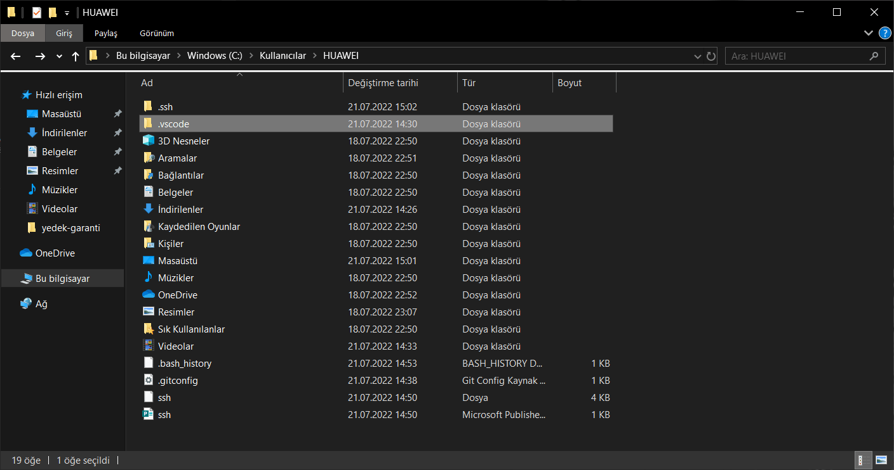

# GİT KURULUMU
<br>

- Git indirip kurduktan sonra email ve isim bilgileri eklmek gerekiyor

- ### ***git config --global user.name "kadir polatkol"***

- ### ***git config --global user.email "kadir polatkol"***


<br>

# GİT KOMUTLAR


- ### **git init** : Git sistemini çalıştırmak başlatmak için kullanılır
<br>

- ### ***git status :*** proje üzerinde yaptığın değişiklilerin hazılanıp hazırlanmadığı veya yeni dosyaların eklenip eklenmediği durumları görüntülemek için kullanılır 


- ### ***git add deneme.py :***  eğer bu şekilde komut verirsen klasörün içindeki deneme.py dosyasındaki değişikleri commit için hazırlar 
- eğer klasördeki tüm dosyaları eklemek veya hazırlamak için  için ***git add .**** komutunu kullanırız

<hr><br>

- ### ***git commit -m ""deneme mesajı :***  git add ile hazılanmış değişiklikleri açıklayıcı bir mesaj ile kayıt etmek için kullanırız 
<br><hr>

- ### ***git log :***  eklediğimiz commitleri kayıt eder ve her commit e id ataması yapar bu id numaralarına göre geriye dönük işlemler yapmak için kullanılır daha detaylı bilgiler de verebilir commiti yapan kullanıcının adı email adresi ne zaman commit yapıldığı gibi bilgileri saklar.
  
<br><hr>


- ### ***.gitignore :*** git içerisinde kaydının tutulmasını **istemediğimiz** dosyaları belirtiriz. Bu dosyalar hiçbir zaman kayıt edilmez ve repository ye eklenmez. *.gitignore* adında  bir klasör oluştururuz ve alt alta hangi dosyaların kayıt edilmesini istemiyorsak klasörlerin isimlerini yazarız.

<br>

# GİT BRANCH KAVRAMI

- Farklı özellikler eklenip sonradan birleştirilmesi gibi takım halinde veya kişisel çalışılacak projelerde sistematik ilerlemek , için kullanılan bir terimdir 

<br><hr>  

### ***_HEAD :*** Git içerisinde hangi konumda olduğumuzu gösteriyor. Branchler veya commitler  açtıkça değişebilir. Daha net anlaşılması için konumumuzu bilerek çalışmalarımızı deam ettirebilmek için konumumuzun nerde olduğunu görmek önemlidir

- var olan branchleri görmek için ***git branch*** yazmak yeterlidir
- 

- yeni bir branch açmak için ***git branch branch_adi*** şeklinde tanımlanabilir

- Branchler arası geçiş yapmak için ***git switch branch_adi***

- branchleri birleştirmek için ise ***git merge dahil_edilecek_branch_adi***

<br><hr>

## FAST FORWARD

- Bir branch açtığımızda master branch imizle çakişmayacak değişiklikler varsa ve çöküş yaşanmayacaksa işleri basitleştirmek için kullanılır ve bu bir terimdir. Eğer değişiklikler çakışmıyorsa birleştirme işlemi yaparız ***git merge dahiledilecek_branchadi*** .Buna fast forward denir. Kısaca ekstra eklediğimiz branchdeki değişiklikleri veya özellikleri  ana branche eklemektir.

<br><hr>


## MERGE CONFLİCT

<br><hr>

## STASH

- git stash ile üzerinde çalıştığınız ancak henüz commit etmediğiniz değişikliklerin geçici olarak Git tarafından kayıt altına alınmasını ve aktif branch'inizin herhangi bir değişikliğin olmadığı temiz bir duruma getirilmesini sağlarsınız. git stash komutunu çalıştırdıktan sonra tekrar git status komutunu çalıştırırsanız önceki bölümde commit edilmemiş bir değişiklik olarak görünen dosya2.md dosyasındaki değişiklik artık listelenmez çünkü master branch’imiz git stash sonrası temiz bir duruma geldi.

## STASH POP 

- stash de yaptığın değişiklikleri listeden atmak için kullanılır

<br><hr>


# COMMİTLER ARASINDA GEZİNMEK GEÇMİŞE DÖNMEK

<br>

### ***git restore dosya_adi :*** "Geri yükle" komutu, onaylanmamış yerel değişiklikleri aşamalandırmaya ve hatta atmaya yardımcı olur. 
Bir yandan, komut git add, Hazırlama Alanına önceden eklediğiniz değişikliklerin etkilerini geri almak ve aşamayı kaldırmak için kullanılabilir.

Öte yandan **restore** komut, bir dosyadaki yerel değişiklikleri atmak ve böylece son taahhüt edilen durumunu geri yüklemek için de kullanılabilir.

<br><hr>


### ***git reset commit_id :*** geçmişteki commite gideriz ve ondan önceki komitleri siler ancak değişiklikleri silmez. Eğer commitlerle beraber yapıla değişiklikleri ve içerikleri de silmek istersen
<br>

***git resert --hard commit_id*** kullanırız commitlerle beraber değişiklikleri ve içerikleri de siler

<br><hr>

### ***git revert commit_id :*** revert ile commitleri geri alabilirsiniz ancak commitlerdeki değişiklikler ve içerikler kaldırılır ancak log da  durur. Resertden farkı ise geri alma işlemi yaparken yeni commit oluşturur ve içerikleri tamamen silmez.

<br><hr>


### ***GİT DİFF***

- hangi commitler veya branchler arasında neler olduğunu hangi içeriklerin eklenip kaldırıldığı veya değiştirildiği gibi bilgileri bize gösterir git diff i sadece çalıştırdığımda dosya içerisindeki güncel verileri getirir.

- iki commit arasıdnaki değişiklikleri incelemek istersek ***git diff commitID_1 commitID_2*** şeklinde aralarına boşluk koyarak commitler arasıdaki farklara bakabiliriz

- iki branch arasındaki farklılıkları görmek istersen **commitID** yerine **branch_isimleri** ni yazarak kontrol edebilirsin  

<br><hr>


### ***REBASE :***

- bir projede branch oluşturduğumzda oluşturduğumuz branchda da master(ana branch) da commitler olabilir ve biz kendi branchımıza da masterdaki commitleri almak istiyor olabiliriz. direkt ***git merge master_branch*** yaparak da ana branchdan commitleri alabilriz bunun için bir kez daha commit eklememiz gerekir. Başka bir yöntem ise ***git rebase*** bunda ise yine aynı işlemi yapar masterdaki commitleri alır ancak logları değiştirerek masterdaki commitleri ayrı eklediğimiz branchdaki commitleri ayrı sıralar bu noktada rebase yapacaksak bu branch i paylaşmamamız gerekir çünkü loglar değişecektir bizim branchimizi paylaşan arkdaslarımızın dosyaları bozulabilir. hem logları temizlemek hem de tarihi tekrar ayarlamak için kullanılabilir.


# GİT SSH TANIMLAMAK 

Git bash açın ve aşağıdaki kodları yapıştırın.


<br>

```
ssh-keygen -t rsa -b 4096 -C "github_email_adresi@.com"
```

<br>

Tırnaklar arasına github da kayıtlı olan gmail adresini yazın
 

<br>

Daha sonra karşımıza çıkan ilk alanı boş geçelim. Bu alanda dosya adını tanımlamamız gerekiyor ancak kendimiz tanımlamasak varsayılan olarak oluşturulacaktır. Eğer kendiniz dosya adı tanımlarsanız geriye kalan kısımda hata alabilirsiniz.

<br>

Dosyalarımızı gönderip alırken kullanacağımız bir şifre ve bu şifrenin tekrarını giriyoruz

<br>

```
eval $(ssh-agent -s)
```

<br>

```
ssh-add ~/.ssh/id_rsa
```

<br>


<br>


Belirlediğimiz şifreyi tekrar giriyoruz ve işlem bu kadar. Dosyanın oluşturulduğu kısım



<br>

.ssh dosyasının içerisine giriyoruz

<br>


<br>

işaretlenen alan şifremizin olduğu kısım. Dilerseniz bu dosyayı kod editörünüze sürükleyip içerisindeki şifreyi kopyalayın. Daha sonra ise github adresinize gidin.

<br>


<br>

Github hesabınıza girdikten sonra ayarlar kısmına gidin .


<br>


<br>

yukarıda gösterilen kısıma gittikten sonra yeni ekle butonuna basın karşınıza aşağıdaki gibi bir alan gelecektir.

<br>


<br>

Kopyaladığınız şifreyi alt kutucuğa yapıştrın ve başlık kısmına da istediğiniz bir şeyi yazın. ssh  ekleme işlemi bu kadardı
