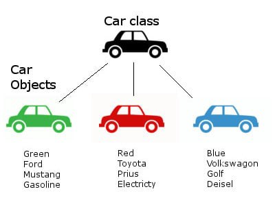

# Nesne Tabanlı Programlama

<br>

Nesne tabanlı programlama bir yazılım geliştirme yöntemidir ve gerçek hayatın yazılıma uyarlanmış halidir.Nesne tabanlı programlama kullanmamızın amacı bir kez yazılan kodların en verimli şekilde tekrar tekrar kullanılabilmesidir. Zaten python programlama dilinin felsefesi  de bu. Nesne tabanlı programlama  yaklaşımı oldukça yaygın kullanılan bir yöntemdir. Nesne tabanlı programlama öğrenmek zorunda değilsin ancak iyi bir programcı olmak istiyorsan öğrenmek zorundasın. Çünkü bu yaklaşım çokça kullanılır ve her yerde karşına çıkar en azından karışına çıktığında kodları okuyabilecek düzeyde öğrenmenizi tavsiye ederim.

Sınıfalardan bahsetmeden önce gerçek hayattan bir örnek verelim. Mesela arabaların hepsi birer nesnedir. Hepsi aynı amaca hizmet eder.Bu arabaların rengi ,fiyat aralığı , ulaşabildiği hızlar , markları , çıkış tarihleri gibi birbirinden farklıdır.

Ancak burada dikkat etmemiz gereken nokta tüm araçların bir fiyatı var tüm araçların rengi , belirli bir hızları var. Bunalrın hepsi ortak özellikler ve hepsi bir fabrikada üretilir.(istisnalar hariç)

Mesela toyota marka araçların üretildiği fabrika düşün bu fabrikada belkide binlerce araç var ve bu araçların hepsi toyota marka ancak birisi daha hızlı gider diğerinin rengi farklıdır veya üretim tarihleri farklıdır.

Buradaki her bir araç birer nesne ise bu aracın üretildiği ortamlar veya fabrikalar sınıf oluyor. Yani biz bu sınıflara gerekli tanımlamaları yapan methodlar tanımlıyoruz ki bu da fabrikada kullanılan robotlar olabilir veya işçiler olabilir.Bizim istediğimiz biçimde nesneler üretmemizi sağlıyor.İşte bu fabrikada kullanılan robotlar veya işçiler sınıflarda tanımlayacağımız metodlara benziyor.

Buradaki benzetme gerçek hayattaki sınıflarla birebir örtüşmeyebilir. Ama sizin nesne tabanlı programlamayı daha iyi anlayabilmeniz için bu örneği veriyorum.Alttaki resimler belki daha iyi anlaşılacaktır.

<br>



<br>


Sınıflar ortak özelliklere sahip gurup ve ya kümeleri tanımlamak için kullanılır.Diğer veri türleri gibi sınıfalar da veri türüdür. 

<br>

# ***Sınıf Tanımlamak***

<br>

Python da sınıf tanımlamak için Class değiminden faydalanıyoruz ve Sınıfların isimleri büyük harfle başlar. Bu bir kural değildir küçük harfle başlasa da olur ancak fonksiyonlar ile sınıfları ayırmak için sınıfları topluluk olarak büyük harfle tanımlarız.

<br>  

```py
class Arabalar:
    pass
```

<br>  

örnekte olduğu gibi arabalar sınıfı tanımladık. Sınıfları nesne üretmek için kullanıdığımızı öğrendik ve  ortak niteliklere ve davranış şekillerine sahip gruplar tanımlamak gerektiğinde son derece kullanışlıdır.Sınfıları tanımlarken parantez de kullanabilirsin.

<br>

```py
class Arabalar():
    pass
```

<br><hr>


## ***Sınıf Nitelikleri***

<br>

```py
class Arabalar():
    renk                = "kırmızı"
    fiyat               =   100000
    araba_ozellikleri   =   []
```

<br>

Yukarıdaki örnekte sınıfaların içerisine tanımladığımız değişkenlere sınıf niteliği (class attribute) denir.Fonksiyonlar ile sınıflar birbirlerine benzerler ancak fonksiyonlar çağırılmadan çalışmazken sınıflar kodlar okunmaya başladığında çalışmaya da başlarlar. Bir örnekle açıklayalım.

<br>

```py
class Arabalar():
    renk                = "kırmızı"
    fiyat               =   100000
    araba_ozellikleri   =   []

    print(renk , fiyat , araba_ozellikleri)
```

<br>

Örnekte de olduğu gibi kodlar okunmaya başladığında sınıf içerisinde tanımladığımız print fonksiyonu çalıştı ve sınıf niteliklerini ekrana yazdırmış olduk.

Print fonksiyonu sınıfın içerisinde kullanmadan sınıf niteliklerine erişmek için aşağıdaki örneğe bakın.

<br>

```py
class Arabalar():
    renk                = "kırmızı"
    fiyat               =   100000
    araba_ozellikleri   =   []

print(Arabalar.renk , Arabalar.fiyat , Arabalar.araba_ozellikleri)

>>> kırmızı 100000 []
```

<br>

Örnekte de olduğu gibi önce sınıf adını yazıp sonra nokta ***(" . ")*** ile sınıf niteliğinin adını belirterek erişiyoruz.Ve sınıf adını yazdıktan sonra parantez kullanmadık.

Yukarıdaki örnekte Sınıf tanımladık Sınıf niteliklerini öğrendik.Eğer istersek sınıf niteliklerini değiştirebiliriz. Bunu bir örnekle açıklayacağım ancak bu kısımda dikkat etmeniz gereken şey biz daha bir nesne üretmedik. Teknik olarak elimizde bir nesne yok ancak renk tanımlaması ve fiyat aralığı gibi sınıf nitelikleri tanımlayarak sanki bir tane nesnemiz varmış gibi görünüyor. Bir sonraki derste nesne üretme ile ilgili konuşalım ve şimdi bir örnekle nesne niteliklerinin değerlerini değiştirelim. 

<br>


```py
class Arabalar():
    renk                = "kırmızı"
    fiyat               =   100000
    araba_ozellikleri   =   []


Arabalar.renk="mavi"
Arabalar.fiyat="200000"

print(Arabalar.renk , Arabalar.fiyat)

>>> mavi 200000
```

<br><hr>


## Nesne Oluşturmak (Sınıfların Örneklenmesi)

<br>

Sınıfalardan nesne üretme işlemine (Sınıfı kullanışlı hale getirme işlemine) örnekleme (nesne üretme) denir.
-  ***örnekleme olayı*** ==> ***instantiation***
-  ***örnek***          ==> ***instance***

<br>

```py
class Arabalar():
    renk                =   "kırmızı"
    fiyat               =   100000
    uretim_yeri         =   []

toyota  =   Arabalar()
ford    =   Arabalar()
bmw     =   Arabalar()

print(f"""
aracın fiyatı :{toyota.fiyat} ,
Aracın Rengi : {toyota.renk} ,
Aracın üretim yerleri:  {toyota.uretim_yeri}
""")

print(f"""
aracın fiyatı :{ford.fiyat} ,
Aracın Rengi : {ford.renk} ,
Aracın üretim yerleri:  {ford.uretim_yeri}
""")

print(f"""
aracın fiyatı :{bmw.fiyat} ,
Aracın Rengi : {bmw.renk} ,
Aracın üretim yerleri:  {bmw.uretim_yeri}
""")


>>> aracın fiyatı :100000 ,
>>> Aracın Rengi : kırmızı ,
>>> Aracın üretim yerleri:  []

>>> aracın fiyatı :100000 ,
>>> Aracın Rengi : kırmızı ,
>>> Aracın üretim yerleri:  []

>>> aracın fiyatı :100000 ,
>>> Aracın Rengi : kırmızı ,
>>> Aracın üretim yerleri:  []
```


<br>

Örnekte de olduğu gibi 3 adet nesne oluştruduk ve sınıfımızı örneklendirdik. Örnekler ile renk , fiyat ve üretim yeri ile bilgilere ulaşabiliryoruz. Yani sınıfta oluşturduğumuz niteliklere (attribute) ulaşabildik.

<br>

Eğer Bu örneklerin içeriklerini kontorl etmek istersen ***dir()*** fonksiyonunu kullanabilirsin

<br>

```py
print(dir(ford))
```

<br>


## ***!!ÖNEMLİ*** 

<br>

Eğer oluşturduğumuz örneklerin değerlerini değiştirmek istersek.

<br>

```py
ford.renk="mavi"

print(ford.renk)
print(toyota.renk)
print(bmw.renk)

# ancak yeni bir nesne oluşturursak

mazda = Arabalar()
print(f"yeni aracın rengi:  {mazda.renk}")
# renk kırmızı olarak aktarıldı çünkü string integer demet gibi değiştirilemeyen veri
# tipleri üzerinden değişiklik yapılamaz ancak yeniden tanımlamak gereklidir.
```

Yukarıdaki örnekte ford örneğinin rengin değiştirdik. ve tekrar sınıfı örneklemeye çalıştığımızda yeni aracın rengi kırmızı olarak tanımlandı ve aynen aktarıldı. Çünkü string integer demet gibi değiştirilemeyen veri tipleri üzerinden değişiklik yapılamaz ancak yeniden tanımlamak gereklidir. Peki sınıfımızda liste sözlük gibi nitelikler varsa nasıl bir sonuçla karşılaşırız. Bir örnekle açıklayalım.

<br>

```py
ford.uretim_yeri.append("almanya , abd")

print(ford.uretim_yeri)
print(bmw.uretim_yeri)
print(toyota.uretim_yeri)

>>> ['almanya , abd']
>>> ['almanya , abd']
>>> ['almanya , abd']
```
<br>

Yukarıdaki örnekte biz sadece ford aracı için üretim yeri tanımlaması yaptık. Ancak diğer örnkeler için uretim yeri niteliğini yazdıracak olursak bizim öyle bir talebimiz olmamasına rağmen diğer niteliklere de eklendi. Eğer tekrar bir örnekleme işlemi yapacak olursak;

<br>

```py
ford.uretim_yeri.append("almanya , abd")

print(ford.uretim_yeri)
print(bmw.uretim_yeri)
print(toyota.uretim_yeri)

mazda = Arabalar()

print(f" mazda aracının rengi:  {mazda.renk}")
print(f" mazda aracı için üretim yeri :  {mazda.uretim_yeri}")

>>> ['almanya , abd']
>>> ['almanya , abd']
>>> ['almanya , abd']
>>> mazda aracının rengi :  kırmızı
>>> mazda aracı için üretim yeri :  ['almanya , abd']
```

<br>

Gördüğünüz gibi yeni örnekler için de aynı durum söz konusu. Eğer sınıf nitelikleri değiştirilebilir veri tütündeki veriler ise tüm örneklere ve ilerde yeni eklenecek örneklere de aynen aktarılır.

Peki biz her örnekte ortak olmayan ve her örneğe özgü olmasını istediğimiz nitelikleri tanımlama istersek nasıl bir yol izleyecez. Bir sonraki konuda ***\_\_init__***  fonksiyonu ve ***self değimlerinden*** söz edelim.


<br>

## ***İnit ve Self***

<br>

Arabalar adında bir sınıf tanımlamıştık. Bu sınıfı örnekleyerek bazı nesneler ürettik. Ürettiğimiz her nesnede sınıfta tanımladığımız sınıf değişkeni (sınıf niteliği) değerleri tüm objelere aynen aktarıldı.

Eğer ki renk ,  üretim yeri gibi özlliklerin her araca özgü olmasını yani her nesneye özgü değişkeler olmasını istersek \_\_init__ fonksiyonunu kullanırız. init fonksiyonu bir ***yapılandırma fonksiyonudur*** ve bu fonksiyonun amacı Sınıfı her örneklediğimizde yani her nesne üretildiğinde , bu fonksiyonun altında tanımlanan değişkenleri veya değerleri üretilen nesnelere tek tek aktarır ve her aktarılan değer o nesneye özgüdür. Bir örnekle açıklayalım.


<br>

```py
class Arabalar():

    toplam_arac =   []
    # sınıf niteliği (class attribute)
    print(f"toplam araç sayısı : {len(toplam_arac)}")

    def __init__(self ,aracin_markasi, renk , fiyat):
        # argümanlar | parametreler ==> Arguments

        self.aracin_markasi       =   aracin_markasi       
        # nesne değişkenleri ==> İnstance Veriables
        self.renk                 =   renk     
        # nesne değişkenleri ==> İnstance Veriables
        self.fiyat                =   fiyat        
        # nesne değişkenleri ==> İnstance Veriables
        
        print(self.aracin_markasi,self.renk , self.fiyat)
```

<br>

Yukarıdaki örnek biraz karışık gelebilir. Daha anlaşılır olması için tek tek fonksiyonumuzu inceleyelim.

İlk başta Sınıf niteliği (sınıf değişkeni) oluşturmuşuz. Bunu daha önceki konularda anlatmıştık. Bu liste ve içerisindeki değerler oluşturulan tüm nesnelerde ulaşabiliyor olacağız. Ben her nesne ürettiğimde bu listenin içerisine araç markasını eklemek istiyorum. Ve print fonksiyonu ile bu üretilen araçların sayısını ekrana yazdıracağım.

Daha sonra ise init fonksiyonumuzu tanımladık. Örnekte de olduğu gibi bazı parametreler almış. İlk parametremiz her zaman self olması gerekiyor. self ingilizcede **kendi** anlamındadır. Yani özetleyecek olursak. İnit fonksiyonu her nesne üretildiğinde bizim tanımladığımız parametre veya değişkenler aracılığı ile üretilen tüm nesnelere ayrı ayrı aktarıyor. Örneklerde de daha net göreceğiz ancak kafanızda canlanması için teorik bir örnek verelim. Bizim sınıf değişkeni olarak oluşturduğumuz toplam_arac listesi üretilecek tüm nesnelerde aynı değere sahip olacak. Eleman sayısı ve değerleri de dahil olmak üzere. Ancak ben aynı listeyi init fonksiyonu içerisinde tanımlarsam bu liste oluşturulan her nesneye özgü olacaktır.Eğer ürettiğimiz bir nesnedeki bu listeyi değiştirisek veya eklersek  bu değerler tanımlanan diğer nesnelere aktarılmayacaktır. Bu sınıf nitelikleri ile nesne nitelikleri arasındaki en büyük farklardan bir tanesidir.


<br>


```py
class Arabalar():

    toplam_arac =   []
    # sınıf niteliği (class attribute)
    print(f"toplam araç sayısı : {len(toplam_arac)}")

    def __init__(self ,aracin_markasi, renk , fiyat):
        # argümanlar | parametreler ==> Arguments

        self.aracin_markasi       =   aracin_markasi       
        # nesne değişkenleri ==> İnstance Veriables
        self.renk                 =   renk     
        # nesne değişkenleri ==> İnstance Veriables
        self.fiyat                =   fiyat        
        # nesne değişkenleri ==> İnstance Veriables
        
        print(self.aracin_markasi,self.renk , self.fiyat)
        


araba1  =   Arabalar(aracin_markasi="mazda", renk = "kırmızı", fiyat = 120000)

>>> toplam araç sayısı : 0
>>> mazda kırmızı 120000
```

<br>

Yukarıdaki örnekte tanımladığımız sınıftan bir nesne oluşturduk. Kodlarımızı çalıştırdığımızda ise sınıfı örneklemeden önce sadece toplam araç sayısını ekrana yazdırıyordu. Bunun sebebi sınıf niteliği (sınıf değişkeni) olan  **toplam_arac** listesi ni print fonksiyonu ile ekrana yazdırmamdı. Ancak ben benzer ifadeyi init fonksiyonunun altında tanımladığımız **örnek niteliklerni** ekrana yazdımak için de print fonksiyonunu kullandım.

Sınıfı örneklemeden önce **sadece Sınıf değişkeni altında tanımladığımız print fonksiyonu çalıştı**. Bunun sebebi ise **init fonksiyonunun sadece nesne oluşturduğumzda çalışmasıdır**. Yeni bir nesne oluşturduk ve sınıfımızı örneklendirdik. Bu sefer hem sınıf niteliği altında tanımladığımız print fonksiyonu çalıştı hem de init fonksiyonu altında tanımladığımız **örnek nitelikleri altındaki** print fonksiyonu çalıştı.


Yukarıdaki örnekte print fonksiyonu kullanmadaki amacım sınıf nitelikleri ile örnek  nitelikleri arasındaki farkı daha detaylı anlatabilmekti.

Şimdi ise eklediğimiz nesnelerin marka adlarını sınıf niteliği olarak tanımladığımız toplam_arac listesine ekleyelim. Ancak bu sınıfı her örneklediğimizde bu işlemi yapmasını sağlayalım.


<br>


```py
class Arabalar():

    toplam_arac =   []

    def __init__(self ,aracin_markasi, renk , fiyat):

        self.aracin_markasi       =   aracin_markasi
        self.renk                 =   renk
        self.fiyat                =   fiyat

        print(self.aracin_markasi,self.renk , self.fiyat)

        Arabalar.toplam_arac.append(self.aracin_markasi)


araba1  =   Arabalar(aracin_markasi="mazda", renk = "kırmızı", fiyat = 120000)

print(Arabalar.toplam_arac)
print(len(Arabalar.toplam_arac))

>>> toplam araç sayısı : 0
>>> mazda kırmızı 120000
>>> ['mazda']
>>> 1
```


<br>

örnekte olduğu gibi sınıfı örneklediğimiz durumda listeye araç marka isimlerini ekledi. Burada sınıfa adını kullanarak Sınıf üzerinden sınıf niteliğine ulaşmış olduk. Bunu daha detaylı inceleyeceğiz. Daha net anlaşılabilmesi için sınıfı bir kez daha örneklendirelim.

<br>

```py
class Arabalar():

    toplam_arac =   []

    def __init__(self ,aracin_markasi, renk , fiyat):

        self.aracin_markasi       =   aracin_markasi
        self.renk                 =   renk
        self.fiyat                =   fiyat

        print(self.aracin_markasi,self.renk , self.fiyat)

        Arabalar.toplam_arac.append(self.aracin_markasi)


araba1  =   Arabalar(aracin_markasi="mazda", renk = "kırmızı", fiyat = 120000)
araba2  =   Arabalar(aracin_markasi="toyota", renk = "mavi", fiyat = 100000)

print(Arabalar.toplam_arac)
print(len(Arabalar.toplam_arac))


>>> mazda kırmızı 120000
>>> toyota mavi 100000
>>> ['mazda', 'toyota']
>>> 2

```

<br>


Bu örneği dikkatlice inceleyin. İlk başta araba1 nesnesini oluşturduk ve bu nesne için print fonksiyonu çalıştı. Daha sonra araba2 nesnesini oluşturduk ve bir kez daha print fonksiyonu çalıştı. Daha önce de bahsettiğim gibi init fonksiyonu nesne üretildiği durumlarda çalışır ve init fonksiyonunun altında oluşturduğumuz nesne değişkenleri ile verileri nesnelere tek tek aktarabiliyoruz.

<br>


Eğer istersek nesneler üzerinden sınıf niteliklerine ulaşabiliriz.
```py
class Arabalar():

    toplam_arac =   []

    def __init__(self ,aracin_markasi, renk , fiyat):

        self.aracin_markasi       =   aracin_markasi       
        self.renk                 =   renk     
        self.fiyat                =   fiyat        

        # print(self.aracin_markasi,self.renk , self.fiyat)

        Arabalar.toplam_arac.append(self.aracin_markasi)


araba1  =   Arabalar(aracin_markasi="mazda", renk = "kırmızı", fiyat = 120000)
araba2  =   Arabalar(aracin_markasi="toyota", renk = "mavi", fiyat = 100000)

print(araba1.toplam_arac)
print(araba2.toplam_arac)

>>> ['mazda', 'toyota']
>>> ['mazda', 'toyota']
```

<br>

örnekte de olduğu gibi nesneler üzerinden sınıf niteliklerine ulaşabiliyoruz. Peki aynı liste hem sınıf niteliği hem de örnek niteliği içinde tanımlanmış olsaydı o zaman nasıl bir sonuçla karşılaşacaktık bir örnekle açıklayalım.


<br>

```py
class Arabalar():

    toplam_arac =   []

    def __init__(self ,aracin_markasi, renk , fiyat):

        self.aracin_markasi       =   aracin_markasi       
        self.renk                 =   renk     
        self.fiyat                =   fiyat        
        self.toplam_arac          =   []
        # print(self.aracin_markasi,self.renk , self.fiyat)

        Arabalar.toplam_arac.append(self.aracin_markasi)


araba1  =   Arabalar(aracin_markasi="mazda", renk = "kırmızı", fiyat = 120000)
araba2  =   Arabalar(aracin_markasi="toyota", renk = "mavi", fiyat = 100000)

print(araba1.toplam_arac)
print(araba2.toplam_arac)

>>> []
>>> []
```

<br>

### ***ÖNEMLİ!!***

<br>


Örnkete de olduğu gibi içi boş bir liste. Ancak bizim sınıf niteliğimizde daha önceden 2 tane değer vardı. Bu değerler orda hâla duruyor. Buradaki olay nesneler üzerinden değişkenlere erişirken önce self fonksiyonunun içerisinde tanımlı olup olmadığına bakar. Eğer örnek niteliklerde tanımlı değilse sınıf niteliklerine bakar ve oradaki değeri alır. 

<br>

```py

class Arabalar():

    toplam_arac =   []

    def __init__(self ,aracin_markasi, renk , fiyat):

        self.aracin_markasi       =   aracin_markasi       
        self.renk                 =   renk     
        self.fiyat                =   fiyat        
        self.toplam_arac          =   []
        # print(self.aracin_markasi,self.renk , self.fiyat)

        Arabalar.toplam_arac.append(self.aracin_markasi)


araba1  =   Arabalar(aracin_markasi="mazda", renk = "kırmızı", fiyat = 120000)
araba2  =   Arabalar(aracin_markasi="toyota", renk = "mavi", fiyat = 100000)


print(f"Objeler üzerinden ulaşmaya çalışmak: {araba1.toplam_arac}")
print(f"Objeler üzerinden ulaşmaya çalışmak: {araba2.toplam_arac}")
print(f"Sınıf üzerinden sınıf niteliklerine: {Arabalar.toplam_arac}")


>>> Objeler üzerinden ulaşmaya çalışmak: []
>>> Objeler üzerinden ulaşmaya çalışmak: []
>>> Sınıf üzerinden sınıf niteliklerine: ['mazda', 'toyota']
```

<br>

Yukarıda örnekte de oldugu gibi sınıf niteliğindeki değerler kaybolmadı. Sadece init fonksiyonda da tanımlı olduğu için yani her bir nesnede bu liste tanımladndığı için öncelikli olarak o getiriliyor. Eğer bizim sınıf değişkenimiz var ve onunla ilgili işlem yapmak isterseniz en garanti yöntem sınıf üzerinden sınıf niteliklerine ulaşmaktır.

İnit fonksiyonunun altında her nesne eklendiğinde aracın markasını sınıf niteliğine ekliyorduk. Dikkatt ederseniz orda sınıf niteliğne erişmek için sınıf adını kullandık.

Son bir örnek daha verelim

<br>


```py
class Arabalar():

    toplam_arac =   []

    def __init__(self ,aracin_markasi, renk , fiyat):

        self.aracin_markasi       =   aracin_markasi       
        self.renk                 =   renk     
        self.fiyat                =   fiyat        
        self.toplam_arac          =   []

        Arabalar.toplam_arac.append(self.aracin_markasi)


araba1  =   Arabalar(aracin_markasi="mazda", renk = "kırmızı", fiyat = 120000)
araba2  =   Arabalar(aracin_markasi="toyota", renk = "mavi", fiyat = 100000)


print(araba1.toplam_arac)
print(araba2.toplam_arac)
# ilk başta örnek niteliklerindeki toplam arac listesi boş


araba1.toplam_arac.append("araba1 nesnesinden eklendi")
#daha sonra sadece araba1 nesnesindeki toplam arac listesine değer eklendi

print(f"araba1 nesnesindeki toplam arac listesi: {araba1.toplam_arac}")
print(f"araba2 nesnesindeki toplam arac listesi: {araba2.toplam_arac}")
# sadece araba1 e eklenen değer araba 2 nesnesine eklenmediğini sadece araba1 
# e özel olduğunu görebilirsiniz


print(f"sınıf nitliğindeki toplam arac listesindeki değerler : {Arabalar.toplam_arac} ")


>>> []
>>> []
>>> araba1 nesnesindeki toplam arac listesi: ['araba1 nesnesinden eklendi']
>>> araba2 nesnesindeki toplam arac listesi: []
>>> sınıf nitliğindeki toplam arac listesindeki değerler : ['mazda', 'toyota'] 
```

<br>


## ***ÖRNEK METODLARI (instance methods)***


<br>


```py
class Arabalar():

    def __init__(self ,aracin_markasi, renk , fiyat):

        self.aracin_markasi       =   aracin_markasi       
        self.renk                 =   renk     
        self.fiyat                =   fiyat        

    def arac_ekle(self):
        print(f" {self.aracin_markasi} marka adına sahip araç eklendi")

arac1   =   Arabalar("opel", "beyaz", 50000)

print(arac1.aracin_markasi)

>>> opel
```
 

<br>

Arabalar sınıfımızı tanımladı ve örnek üzerinden sınıf metodlarını inceleyelim. 

Örnekte de olduğu gibi sınıf içerinde init fonksiyonunun hemen altında  bir örnek metodu yani *instance method* tanımladık. Bu fonksiyonların ilk parametresi her zaman self olmalıdır. Bu fonksiyonlar sınıfın örnekleri ile çağrılabilir.Bu fonksiyonu kullanırken init fonksiyonunun altında tanımladığımız nesne  değişkenlerine  (*İnstance Veriables*) ulaşabilir ve istediğimiz metodları tanımlayabiliriz. Mesela örnekte tanımaldığımız. Arac ekle metodu bir örnek metodu dur ve ***bu metodu nesneler üzerinden çağırarak*** yapılan işlemleri rahatlıkla görebiliriz.

Örnek metodlarında iyi kavramamız gereken nokta her bir nesne için ayrı ayrı çalıştırılıyor ve her bir nesneye özel olmasıdır. Eğer bir nesneden bu değeri değiştirirsek bu diğer nesnelere de **yansımaz**.

Eğer sınıfı örneklediğimizde tanımladığımız fonksiyonun çalışmasını istersen bir sonraki örneği dikkatli incelemelisin.

<br>

```py
class Arabalar():

    def __init__(self ,aracin_markasi, renk , fiyat):

        self.aracin_markasi       =   aracin_markasi       
        self.renk                 =   renk     
        self.fiyat                =   fiyat        
        self.arac_ekle()

    def arac_ekle(self):
        print(f" {self.aracin_markasi} marka adına sahip araç eklendi")


arac1   =   Arabalar("mercedes", "beyaz", 130000)

>>>  mercedes marka adına sahip araç eklendi
```

<br>


Örnekte de olduğu gibi eğer self değimi ile beraber tanımladığımız fonksiyonu init fonksiyonu altında belirtirsek sınıfı örneklediğimiz anda o fonksiyon çalışacaktır.


Biraz da olası hatalardan bahsedelim;

```py
class Arabalar():

    def __init__(self ,aracin_markasi, renk , fiyat):

        self.aracin_markasi       =   aracin_markasi       
        self.renk                 =   renk     
        self.fiyat                =   fiyat        

    def arac_ekle(self):
        print(f"markası  {self.aracin_markasi} olan araç eklendi")


arac1   =  Arabalar("mercedes", "beyaz", 130000)
arac2   =   Arabalar("bmw", "mavi", 120000)

arac1.arac_ekle()
arac2.arac_ekle()

>>> markası  mercedes olan araç eklendi
>>> markası  bmw olan araç eklendi
```


<br>

Yukarıdaki örnek doğru bir kullanımdır. Örnek metodlarına ulaşmak için örnkeler üzerinden sorgulama yapmak gerekiyor peki biz sınıf üzerinden örnek metodlarına ulaşmak istersek nasıl bir yol izleyebiliriz. Aşağıdaki örneğe dikkatli bakın

 <br>


```py

class Arabalar():

    def __init__(self ,aracin_markasi, renk , fiyat):

        self.aracin_markasi       =   aracin_markasi       
        self.renk                 =   renk     
        self.fiyat                =   fiyat        

    def arac_ekle(self):
        print(f"markası  {self.aracin_markasi} olan araç eklendi")


arac1   =  Arabalar("mercedes", "beyaz", 130000)
arac2   =   Arabalar("bmw", "mavi", 120000)

Arabalar.arac_ekle()
Arabalar.arac_ekle()

>>> Traceback (most recent call last):
>>>   File "dizin", >>> line 38, in <module>
>>>     Arabalar.arac_ekle()
>>> TypeError: arac_ekle() missing 1 required positional argument: 'self'
```

<br>


Hata almamızın sebebi bu fonksiyon self parametresi alıyor yani bu sınıftaki örnekleri temsil ediyordu. Hata vermesi çok normal çünkü hangi örneği getireceğini biz belirtmedik. Bunun için aşağıdaki gibi kullanabilirsin. Ama gerek yok tabiki çünkü zaten biz nesneler üzerinden erişebiliyoruz bu değerlere. Bu örneği verme amacım örnek metodlarını iyi kavrayabilmek ve aradaki farkı görmek , olası hataların önüne geçmektir.

<br>

```py
class Arabalar():

    def __init__(self ,aracin_markasi, renk , fiyat):

        self.aracin_markasi       =   aracin_markasi       
        self.renk                 =   renk     
        self.fiyat                =   fiyat        

    def arac_ekle(self):
        print(f"markası  {self.aracin_markasi} olan araç eklendi")


arac1   =  Arabalar("mercedes", "beyaz", 130000)
arac2   =   Arabalar("bmw", "mavi", 120000)

print("nesneler üzerinden erişmek")
print("-------------------------------------")
arac1.arac_ekle()
arac2.arac_ekle()

print("-------------------------------------")

print("sınıf üzerinden erişmek")
Arabalar.arac_ekle(self =   arac1)
Arabalar.arac_ekle(self =   arac2)


>>> nesneler üzerinden erişmek
>>> -------------------------------------
>>> markası  mercedes olan araç eklendi
>>> markası  bmw olan araç eklendi
>>> -------------------------------------
>>> sınıf üzerinden erişmek
>>> markası  mercedes olan araç eklendi
>>> markası  bmw olan araç eklendi
```

<br>


Sınıf üzerinden örnek metoduna ulaştık ve self yerine tanımladığımız olan örneğin  adını verdik.Örnek metodları bu şekilde de çalışıyor. Peki örnek metodumuz dişarıdan parametre alırsa nelere dikkat edeceğiz örnekle açıklayalım.

<br>

```py
class Arabalar():

    def __init__(self ,aracin_markasi, renk , fiyat):

        self.aracin_markasi       =   aracin_markasi       
        self.renk                 =   renk     
        self.fiyat                =   fiyat        

    def arac_ekle(self , model):
        print(f"markası  {self.aracin_markasi} modeli {model} olan araç eklendi")


arac1   =  Arabalar("mercedes", "beyaz", 130000)
arac2   =   Arabalar("bmw", "mavi", 120000)

arac1.arac_ekle("1999")
# örnek üzerinden 2. parametre ile veri ekleme 

Arabalar.arac_ekle(arac2 , 2002)
# sınıf üzerinden 2. parametre ile veri ekleme 

>>> markası  mercedes modeli 1999 olan araç eklendi
>>> markası  bmw modeli 2002 olan araç eklendi
```

<br>

Sınıf üzerinden çağırırken ilk parametre ile örneğimizi belirttik daha sonra ise ikinci parametre ile ***örnek metodunun ikinci parametresini*** verdik .


Eğer örnek fonksiyonumuzu sınıf örneklediğimiz çalışmasını sağlamak istiyorsak aynı zamanda da örnek metodumuzun ikinci parametresini  model bilgisini göndermek istersek aşağıdaki örnekteki gibi tanımlama yapabiliriz.

<br>

```py
class Arabalar():

    def __init__(self ,aracin_markasi, renk , fiyat , model):

        self.aracin_markasi       =   aracin_markasi       
        self.renk                 =   renk     
        self.fiyat                =   fiyat        
        self.model                =   model
        self.arac_ekle(self.model)

    def arac_ekle(self , model):
        print(f"markası  {self.aracin_markasi} modeli {model} olan araç eklendi")


arac1   =  Arabalar("mercedes", "beyaz", 130000 , 1999)
arac2   =   Arabalar("bmw", "mavi", 120000 , 2002)

>>> markası  mercedes modeli 1999 olan araç eklendi
>>> markası  bmw modeli 2002 olan araç eklendi
```

<br>


Bu örnekte sınıfı oluşturuken aldığımız model bilgisini örnek fonksiyonda 2. parametre olarak gönderdik  ve örnekleme işlemi yaptığımız anda araç bilgilerini ekrana yazdırdı. ancak bu şekilde değilde direkt örnek fonksiyonumuzun içerisinde de bu değerlere ulaşabilirdik.


<br>

```py
class Arabalar():

    def __init__(self ,aracin_markasi, renk , fiyat , model):

        self.aracin_markasi       =   aracin_markasi       
        self.renk                 =   renk     
        self.fiyat                =   fiyat        
        self.model                =   model
        self.arac_ekle()

    def arac_ekle(self):
        print(f"markası  {self.aracin_markasi} modeli {self.model} olan araç eklendi")


arac1   =  Arabalar("mercedes", "beyaz", 130000 , 1999)
arac2   =   Arabalar("bmw", "mavi", 120000 , 2002)

>>> markası  mercedes modeli 1999 olan araç eklendi
>>> markası  bmw modeli 2002 olan araç eklendi
```

<br>

Sonuç olarak init fonksiyonu içerisinde tanımladığımız nesne değişkenlerine nesne metodları içinde rahatlıkla ulaşabiliyoruz. Ayrıca parametre olarak bu değerleri göndermemize gerek yok.


